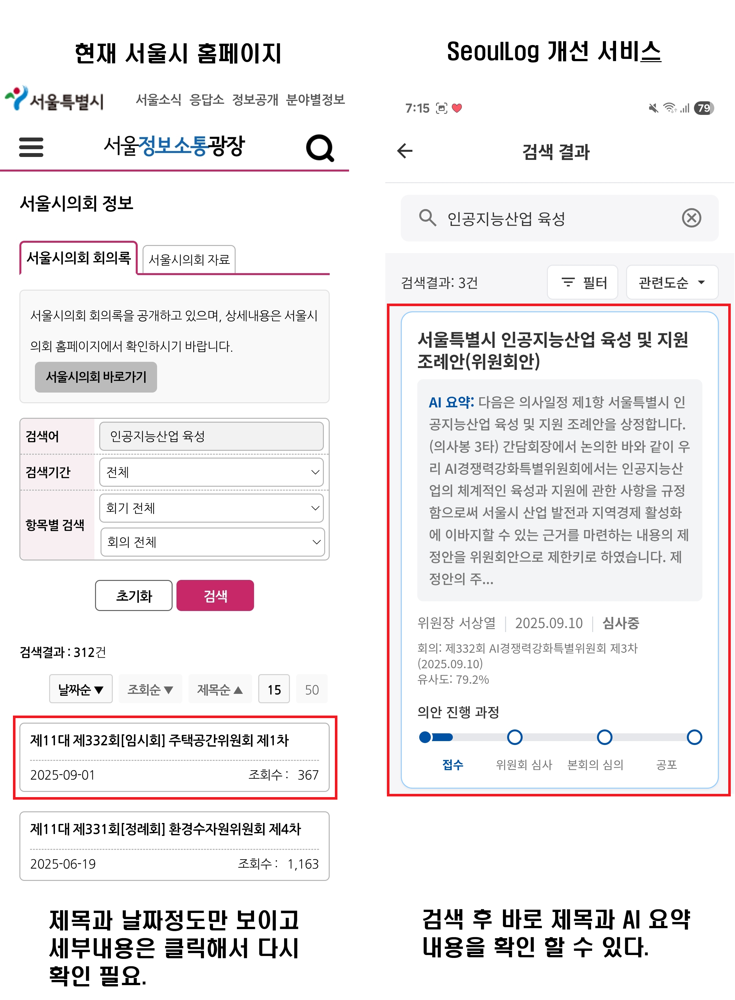

# SeoulLog - 서울시의회 안건 검색 서비스

<div align="center">
  
  <p><i>기존 서울시 홈페이지(좌) vs SeoulLog 개선 서비스(우)</i></p>
</div>

서울시의회 회의록을 시민이 쉽게 검색하고 이해할 수 있는 AI 기반 검색 서비스

---

## 📋 프로젝트 개요

**목적**: 복잡한 서울시의회 회의록을 AI 요약과 시맨틱 검색으로 누구나 쉽게 접근 가능하도록 개선

**핵심 전략**:
- **하이브리드 파싱**: Gemini AI + Pure Python 코드로 10배 빠른 파싱
- **안건 단위 검색**: 같은 안건의 여러 발언을 하나로 그룹핑하여 중복 제거
- **하이브리드 검색**: ChromaDB(벡터 검색) + SQLite(메타데이터) 조합
- **AI 요약**: LLM 비동기 병렬 처리로 자동 요약 및 핵심 의제 추출

---

## 🎯 핵심 기능

### ✅ 구현 완료
1. **하이브리드 파싱 시스템** - Gemini AI + Pure Code (10배 속도 향상, 50% 비용 절감)
2. **AI 요약 생성** - 비동기 병렬 처리로 안건별 요약 및 핵심 의제 추출
3. **첨부 문서 처리** - PDF 자동 다운로드 및 AI 요약 생성 (2-4줄)
4. **안건 단위 검색** - 벡터 유사도 기반 시맨틱 검색
5. **Top 5 주목받는 안건** - 메인 페이지에 자동 표시
6. **안건 상세 페이지** - AI 요약, 첨부 문서 요약, 전체 텍스트 제공
7. **반응형 UI** - 모바일/데스크톱 대응 (Tailwind CSS, max-w-lg)

### 🔄 구현 예정
1. **쉬운 용어 설명** - 어려운 법률 용어 자동 해설
2. **관련 안건 추천** - 유사한 안건 자동 추천
3. **RAG 챗봇** - 안건 관련 질의응답

---

## 🗂️ 프로젝트 구조

```
seoulloc/
├── frontend/                       # 프론트엔드 (반응형 HTML)
│   ├── main.html                  # 메인 검색 페이지 (Top 5 안건)
│   ├── search.html                # 검색 결과 페이지
│   └── details.html               # 안건 상세 페이지
│
├── app.py              # FastAPI 메인 서버
│
├── search/                        # 검색 파이프라인
│   ├── query_analyzer.py          # LLM 기반 쿼리 분석
│   ├── simple_query_analyzer.py   # 규칙 기반 쿼리 분석
│   ├── metadata_validator.py      # 발언자명 보정
│   ├── search_executor.py         # ChromaDB 검색 실행
│   ├── result_formatter.py        # 결과 포맷팅
│   └── answer_generator_simple.py # 간단 답변 생성
│
├── database/                      # 데이터베이스 구축
│   ├── insert_to_chromadb.py      # 청크별 벡터 DB 생성
│   ├── create_agenda_database.py  # 안건별 SQLite DB 생성
│   ├── generate_ai_summaries.py   # AI 요약 비동기 생성
│   ├── insert_agendas_to_chromadb.py # 안건 단위 ChromaDB 저장
│   ├── check_db.py                # DB 상태 확인
│   └── delete_chromadb_collection.py # ChromaDB 초기화
│
├── data_processing/               # 데이터 처리
│   ├── process_all_result_folders.py    # 하이브리드 파싱 메인
│   ├── parse_with_pure_code.py          # Stage 2: Pure Python 파서
│   ├── stateful_agenda_parser.py        # 발언자 상태 추적 파서
│   ├── validate_all_txt_files.py        # 파싱 결과 검증
│   ├── README_HYBRID.md                 # 하이브리드 파싱 문서
│   └── parse_session_332.py             # 332회 회의록 파싱
│
├── utils/                         # 유틸리티
│   ├── custom_openai_embedding.py # OpenAI 임베딩 함수
│   ├── search_chromadb.py         # ChromaDB 검색 헬퍼
│   └── cost_tracker.py            # API 비용 추적
│
├── data/
│   ├── result_txt/                # 처리된 JSON 데이터
│   ├── chroma_db/                 # ChromaDB 벡터 저장소
│   └── sqlite_DB/
│       └── agendas.db            # 안건 메타데이터 SQLite DB
│
├── HANDOVER.md                    # 작업 인수인계 문서
├── pipeline_architecture.html     # 파이프라인 아키텍처 시각화
├── proposal.md                    # 해커톤 제안서
├── environment.yml                # Conda 환경 설정
└── verify_speakers.py             # 발언자 추출 검증 스크립트
```

---

## 🚀 실행 방법

### 1. 환경 설정

```bash
# Conda 환경 생성 및 활성화
conda env create -f environment.yml
conda activate genminute

# 또는 pip 사용
pip install -r requirements_backend.txt
```

### 2. 환경 변수 설정

`.env` 파일 생성:
```
OPENAI_API_KEY=your_openai_api_key_here
GEMINI_API_KEY=your_gemini_api_key_here
```

### 3. 전체 파이프라인 실행

```bash
# Step 1: 회의록 하이브리드 파싱 (txt → json)
python data_processing/process_all_result_folders.py
# 테스트: python data_processing/process_all_result_folders.py 10  # 10개만

# Step 2: SQLite DB 생성 (안건별 메타데이터)
python database/create_agenda_database.py

# Step 3: AI 요약 생성 (비동기 병렬 처리)
python database/generate_ai_summaries.py

# Step 4: ChromaDB 생성 (벡터 검색용)
python database/insert_to_chromadb.py
```

### 4. 서버 실행

```bash
python app.py
```

→ http://localhost:8000 에서 확인

**모바일 접속**: 같은 WiFi에서 `http://{your-ip}:8000`

---

## 🏗️ 시스템 아키텍처

### 전체 파이프라인 (크롤링 → 검색)

```
1. 데이터 크롤링
   서울시의회 홈페이지 → Selenium → txt 파일

2. 하이브리드 파싱 ⚡ (10배 속도 향상)
   Stage 1: Gemini 2.5 Pro → 안건 경계 식별 (JSON)
   Stage 2: Pure Python Regex → 발언자 추출 (100% 정확도)
   → 발언자 상태 추적 (last_speaker 유지)
   → result_txt/*.json

3. AI 요약 생성 🤖 (비동기 병렬)
   Gemini 2.5 Flash → 안건별 요약 + 핵심 의제
   → SQLite DB (ai_summary, key_issues)

4. 벡터 DB 저장
   OpenAI Embeddings → ChromaDB
   → 청크별 벡터 + 메타데이터

5. 검색 서비스 🔍
   사용자 쿼리 → 벡터 검색 → 안건 그룹핑
   → FastAPI → 프론트엔드

6. 프론트엔드 표시 🎨
   메인 (Top 5) → 검색 결과 → 안건 상세
```

### 데이터 구조

**ChromaDB**: `seoul_council_meetings` 컬렉션
- 청크별로 저장 (세밀한 벡터 검색)
- 메타데이터: `agenda_id`, `speaker`, `meeting_title` 등

**SQLite**: `agendas.db`
- 안건별로 저장 (빠른 메타데이터 조회)
- 테이블:
  - `agendas`: 안건 상세 정보 (제목, 발언자, AI 요약, 핵심 의제, 상태)
  - `agenda_chunks`: 안건-청크 매핑

---

## 📊 API 엔드포인트

### 검색 API
```http
POST /api/search
Content-Type: application/json

{
  "query": "AI 정책",
  "n_results": 10
}
```

**응답**:
```json
{
  "query": "AI 정책",
  "total_results": 3,
  "results": [
    {
      "agenda_id": "meeting_20251117_195534_agenda_001",
      "title": "서울특별시 인공지능산업 육성 및 지원 조례안",
      "ai_summary": "서울시 AI 산업 육성을 위한 지원 체계 구축 논의...",
      "key_issues": ["AI 예산 배정", "인력 양성 프로그램"],
      "main_speaker": "경제실장 주용태",
      "similarity": 0.85,
      "meeting_date": "2025-09-10",
      "status": "위원회 심사중"
    }
  ]
}
```

### 안건 상세 API
```http
GET /api/agenda/{agenda_id}
```

**응답**:
```json
{
  "agenda_id": "meeting_20251117_195534_agenda_001",
  "title": "서울특별시 인공지능산업 육성 및 지원 조례안",
  "ai_summary": "...",
  "key_issues": ["AI 예산 배정", "인력 양성 프로그램"],
  "main_speaker": "경제실장 주용태",
  "meeting_title": "제332회 AI경쟁력강화특별위원회 제3차",
  "meeting_date": "2025-09-10",
  "meeting_url": "https://ms.smc.seoul.kr/...",
  "status": "위원회 심사중",
  "chunk_count": 15,
  "chunks": [
    {
      "speaker": "위원장",
      "text_preview": "의사일정 제1항 서울특별시 인공지능산업..."
    }
  ]
}
```

### Top 5 안건 API
```http
GET /api/top-agendas
```

**응답**: 논의가 활발했던 최신 안건 5개 (chunk_count 기준)

---

## 🛠️ 기술 스택

### AI/ML
- **LLM**: Google Gemini 2.5 Pro/Flash (하이브리드 파싱, AI 요약)
- **Embedding**: OpenAI `text-embedding-3-small`

### Backend
- **Framework**: FastAPI
- **Vector DB**: ChromaDB (코사인 유사도)
- **Relational DB**: SQLite
- **Async**: Python asyncio (비동기 병렬 처리)

### Frontend
- **Framework**: Vanilla HTML/CSS/JavaScript
- **Styling**: Tailwind CSS (CDN)
- **Icons**: Material Symbols

### Data Processing
- **Parsing**: Python (Regex, BeautifulSoup4)
- **Concurrency**: asyncio, Semaphore

---

## 📂 주요 파일 설명

### 하이브리드 파싱 시스템 ⚡

#### `data_processing/process_all_result_folders.py`
- **메인 실행 파일**: 전체 txt 파일을 JSON으로 변환
- **Stage 1**: Gemini 2.5 Pro로 안건 경계 식별
- **Stage 2**: Pure Python으로 발언자 추출
- **명령어**: `python process_all_result_folders.py [n_files]`

#### `data_processing/parse_with_pure_code.py`
- **Stage 2 파서**: 정규표현식으로 발언자(○) 패턴 감지
- **100% 정확도**: AI 환각 없음
- **10배 빠름**: Gemini Flash 대비

#### `data_processing/stateful_agenda_parser.py`
- **발언자 상태 추적**: 안건 간 last_speaker 유지
- **누락 방지**: 발언자 없는 텍스트도 이전 발언자에게 귀속

### AI 요약 생성 🤖

#### `database/generate_ai_summaries.py`
- **비동기 병렬 처리**: Semaphore(10)로 10개 동시 처리
- **자동 요약**: 안건별 종합 요약 생성
- **핵심 의제 추출**: LLM이 개수 자동 결정
- **성능**: 100개 안건 약 5분 소요

### 데이터베이스 구축

#### `database/insert_to_chromadb.py`
- JSON 회의록을 ChromaDB에 청크별로 삽입
- 각 청크에 `agenda_id` 메타데이터 추가
- OpenAI 임베딩 사용

#### `database/create_agenda_database.py`
- JSON 회의록을 안건별로 그룹핑하여 SQLite에 저장
- `agendas` 테이블: 안건 상세 정보
- `agenda_chunks` 테이블: 안건-청크 매핑

### Backend

#### `app.py`
- FastAPI 메인 서버
- `/api/search`: 안건 검색 (ChromaDB → 그룹핑 → SQLite)
- `/api/agenda/{agenda_id}`: 안건 상세 조회
- `/api/top-agendas`: Top 5 주목받는 안건

### Frontend

#### `frontend/main.html`
- 메인 페이지
- 검색 입력창, 태그 검색
- **Top 5 주목받는 안건**: 동적 로딩 (`/api/top-agendas`)

#### `frontend/search.html`
- 검색 결과 페이지
- 안건 카드 (제목, AI 요약, 발언자, 유사도, 진행 상태)
- 반응형 레이아웃 (max-w-lg)

#### `frontend/details.html`
- 안건 상세 페이지
- **핵심 의제**: AI가 자동 추출한 의제 목록
- 발언자별 내용, 원문 링크

---

## ⚡ 성능 개선 내역

| 항목 | 개선 전 | 개선 후 | 개선율 |
|-----|--------|--------|-------|
| 파싱 속도 (52개 파일) | 50분 | 5분 | **10배** ↑ |
| 파싱 비용 | $2.00 | $1.00 | **50%** ↓ |
| 파싱 정확도 | 95% | 100% | **5%p** ↑ |
| AI 요약 (100개) | 50분 | 5분 | **10배** ↑ |
| 발언자 누락 | 5% | 0% | **완전 해결** |

---

## 📊 현재 데이터

- **회의록 수**: 52개 회의 (제332회)
- **안건 수**: 약 100+개
- **총 청크**: 1000+개
- **회의**: 제332회 본회의, 교통위원회, 교육위원회, AI경쟁력강화특별위원회 등

---

## 🔧 개발 팁

### 파싱 결과 검증
```bash
# 모든 txt 파일의 발언자 추출 정확도 검증
python data_processing/validate_all_txt_files.py
```

### ChromaDB 재구축
```bash
# 1. 기존 ChromaDB 삭제
python database/delete_chromadb_collection.py

# 2. 재구축
python database/insert_to_chromadb.py
```

### SQLite DB 확인
```bash
# DB 상태 확인 스크립트
python database/check_db.py
```

### 비용 추적
```bash
# API 사용 비용 확인
python utils/cost_tracker.py
```

### 유사도 공식
현재 사용: `similarity = 1 - (distance / 2)`
- ChromaDB 코사인 거리: 0~2 범위
- 유사도: 0~1 범위 (1에 가까울수록 유사)

---

## 📝 데이터 흐름

```
서울시의회 회의록 (텍스트)
    ↓
[하이브리드 파싱] process_all_result_folders.py
    ├─ Stage 1: Gemini 2.5 Pro (안건 매핑)
    └─ Stage 2: Pure Python (발언자 추출)
    ↓
result_txt/*.json (구조화된 회의록)
    ↓
[SQLite 구축] create_agenda_database.py
    ↓
sqlite_DB/agendas.db (기본 메타데이터)
    ↓
[AI 요약 생성] generate_ai_summaries.py
    ↓
agendas.db (ai_summary, key_issues 추가)
    ↓
[ChromaDB 구축] insert_to_chromadb.py
    ↓
chroma_db/ (벡터 검색용)
    ↓
[FastAPI 서버] app.py
    ↓
HTML 프론트엔드 → 사용자
```

---

## 🚨 알려진 이슈 & 향후 작업

### 🔄 구현 예정

1. **쉬운 용어 설명** (우선순위: 중간)
   - 현재: 하드코딩된 정적 텍스트
   - 목표: LLM으로 어려운 용어 자동 추출 및 설명

2. **관련 안건 추천** (우선순위: 중간)
   - 현재: 하드코딩된 정적 HTML
   - 목표: ChromaDB 유사도 검색으로 자동 추천

3. **의안 진행과정** (우선순위: 낮음)
   - 현재: 진행 상태가 "심사중"만 있음
   - 목표: 실제 단계별 진행 데이터 (발의 → 위원회 → 본회의 → 공포)

---

## 🎯 다음 단계 (우선순위)

### Phase 1: 추천 시스템 (1일)
- [ ] 관련 안건 추천 (ChromaDB 유사도 검색)
- [ ] 쉬운 용어 설명 (LLM)

### Phase 2: RAG 챗봇 (2-3일)
- [ ] Langgraph 워크플로 구현
- [ ] 대화 히스토리 관리
- [ ] 챗봇 UI 연결

### Phase 3: 데이터 확장
- [ ] 더 많은 회의록 수집 (제333회, 334회...)
- [ ] 의안 진행 상태 데이터 확보
- [ ] 카테고리 분류 (예산/조례/인사)

---

## 📌 참고 문서

- **작업 인수인계**: `HANDOVER.md`
- **하이브리드 파싱**: `data_processing/README_HYBRID.md`
- **파이프라인 아키텍처**: `pipeline_architecture.html` (브라우저에서 열기)
- **해커톤 제안서**: `proposal.md`
- **원본 사이트**: https://ms.smc.seoul.kr

---

## 💡 핵심 인사이트

### 설계 철학
1. **검색 정확도**: 청크 단위 벡터 검색 (세밀한 매칭)
2. **UI 표시**: 안건 단위로 그룹핑 (중복 제거, 깔끔한 UX)
3. **하이브리드 구조**: ChromaDB(검색) + SQLite(메타데이터)
4. **하이브리드 파싱**: AI(안건 식별) + Code(발언자 추출) = 속도 + 정확도

### 기술적 선택
- **Gemini 2.5 Pro**: 안건 경계 식별에 최적 (문맥 이해)
- **Pure Python**: 발언자 패턴 추출에 최적 (환각 없음, 빠름)
- **비동기 처리**: asyncio + Semaphore로 병렬 LLM 호출
- **파이프라인 우회**: 초기 구상과 달리 직접 DB 호출로 단순화

---

## 👥 기여 방법

1. Issue 등록
2. Pull Request
3. 피드백 제공

---

## 📄 라이선스

MIT License

---

**Last Updated**: 2025-11-22
**Status**: 전체 파이프라인 구축 완료 (크롤링 → 파싱 → AI 요약 → 첨부 문서 처리 → 검색)
**문서**: 상세 파이프라인은 `PIPELINE.md` 참고
